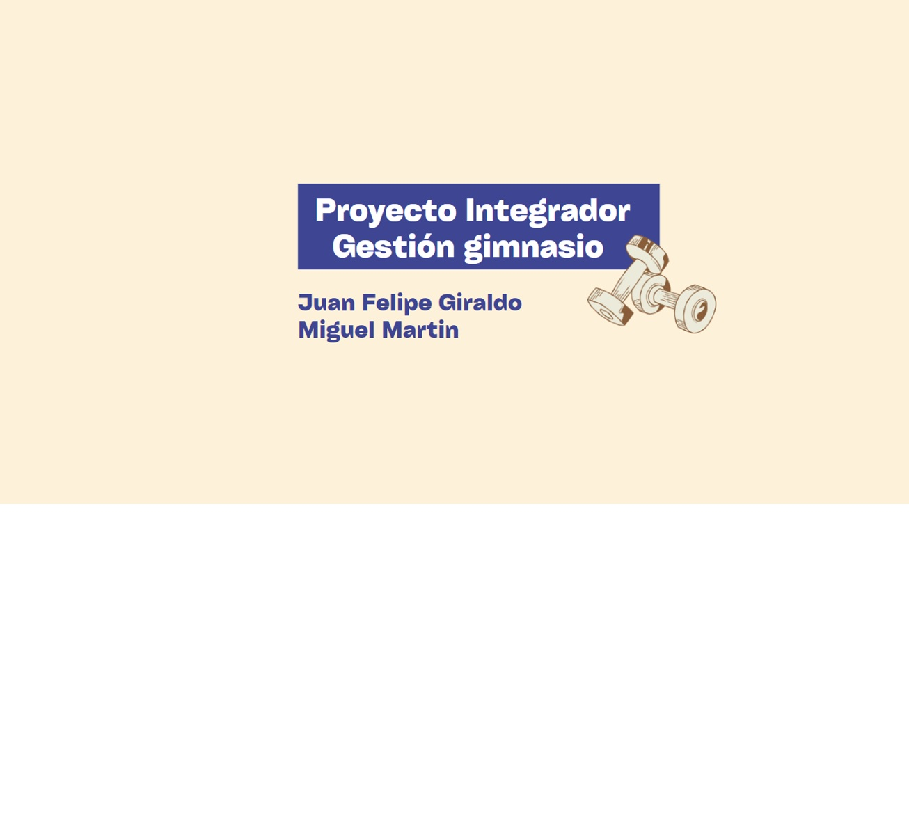
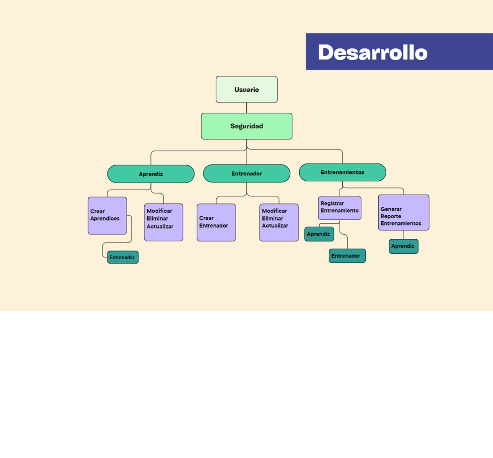
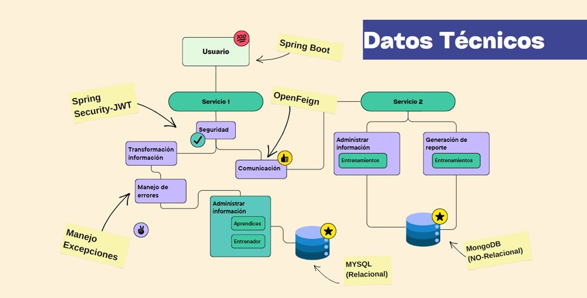

## API REST Gestion gimnasio 🤸‍♀️🏋️‍♀️
Se ha desarrollado una aplicación RESTful (API REST) utilizando Java 17.0.9 en el entorno de programación IntelliJ IDEA, con el fin de gestionar el registro y control de entrenamientos, entrenadores y aprendices. Esta aplicación hace uso del gestor de dependencias Maven para facilitar la gestión de librerías y componentes necesarios.

## Datos tecnicos 🔧
El proyecto ha sido estructurado en dos servicios para mejorar la eficiencia y optimizar el programa. El primero, denominado "gestion-gym", se encarga de gestionar los modelos como aprendices, entrenadores y entrenamientos, utilizando DTOs (Data Transfer Objects), implementando seguridad mediante Spring Security y manejando excepciones. También administra la conexión con una base de datos relacional (SQL) utilizando Spring Data JPA. Además, este servicio se comunica con el otro servicio a través de OpenFeign y expone los endpoints al cliente mediante Spring Boot, facilitando la documentación con Swagger. Por otro lado, el segundo servicio, llamado "Reportes-Service", recibe los entrenamientos y gestiona la información para almacenarla en una base de datos no relacional (MongoDB), generando mensualmente los reportes de los aprendices según los requerimientos del cliente.

